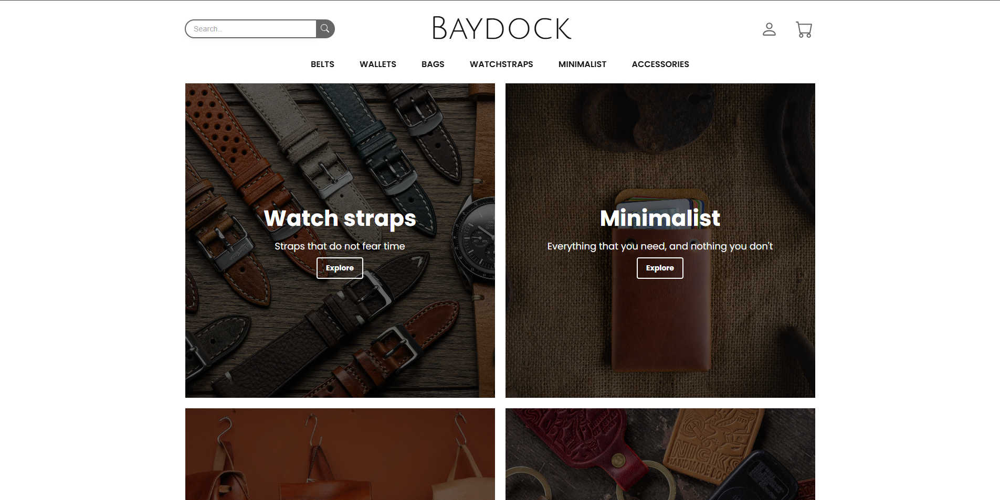
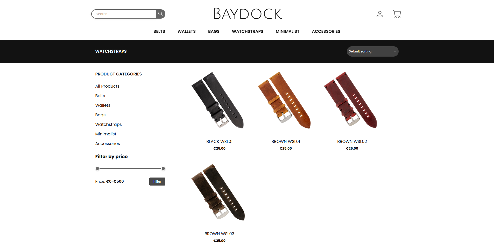
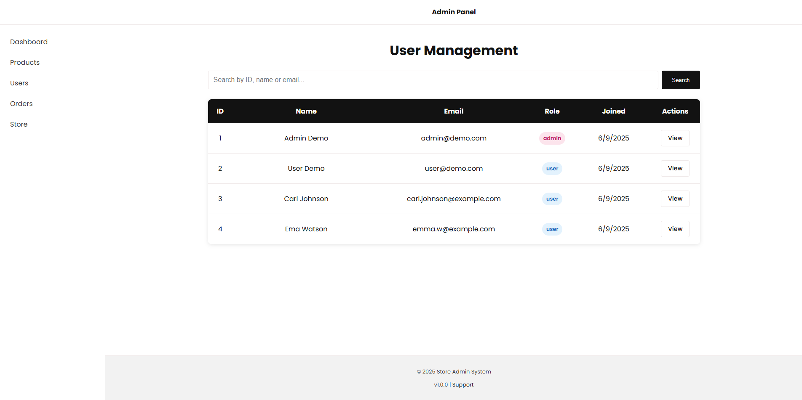
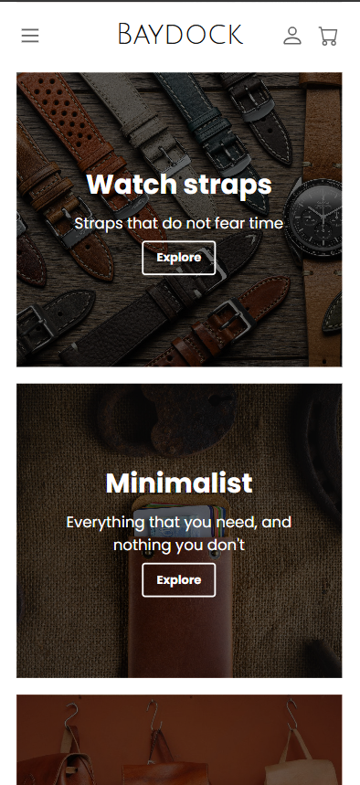
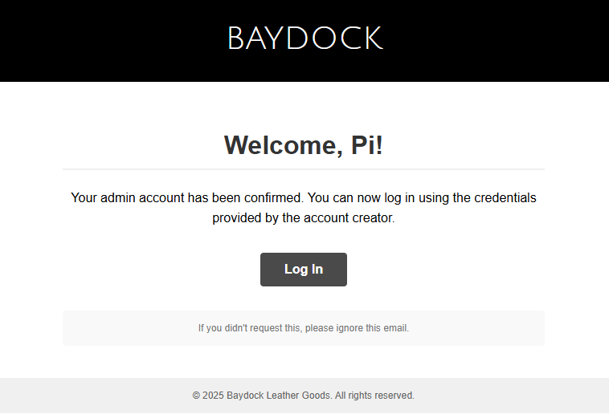

# Baydock Leatherworks Store 🛍️

A stylish, full-featured web store for unique leather crafts. Users can register, log in, browse products, add to cart, place orders, and view order history. Admins can manage products, orders, and users.

**Demo-ready with Docker, or run locally for development.**

---

## Table of Contents

- [Features](#features)
- [Tech Stack](#tech-stack-)
- [Screenshots](#screenshots-)
- [Getting Started](#getting-started-)
  - [Run with Docker](#1-run-with-docker-recommended)
  - [Local Development Setup](#local-development-setup)
- [Environment Variables](#environment-variables)
- [Database Setup](#database-setup)
- [Demo](#demo-)
  - [Demo Accounts](#accounts)
  - [Demo Restrictions](#restrictions)
- [Testing](#testing-)
- [Project Structure](#project-structure-)
- [Security](#security-)
- [Missing Features & Future Improvements](#missing-features--future-improvements)
- [Contributing](#contributing)
- [License](#license)

---

## Features

### User Features

- ✅ Secure authentication (register/login with email confirmation)
- 🔑 Password reset flow
- 🛒 Guest cart that persists through login/registration
- 📦 Order history with address snapshots
- 🏠 Address management (shipping/billing)

### Admin Features

- 👔 Admin dashboard
- 🛍️ Product management (CRUD operations, including image uploads — see [Product Image Uploads](#product-image-uploads))
- 📊 Order status management
- 👥 User administration

### Technical Features

- 🚀 Demo mode with preloaded data
- 📱 Mobile-first responsive design with SCSS
- 🔒 Backend validation with Joi schemas
- ✉️ Email service (Mailtrap/Nodemailer)

---

## Tech Stack💻

| Component        | Technology            |
| ---------------- | --------------------- |
| Backend          | Node.js, Express      |
| Database         | PostgreSQL            |
| Authentication   | Passport.js, bcryptjs |
| Sessions         | connect-pg-simple     |
| Templating       | EJS                   |
| Styling          | SCSS                  |
| Testing          | Vitest                |
| Containerization | Docker                |

---

## Screenshots📷

### Homepage (Desktop)



## Product Page



### Admin Dashboard



### Homepage (Mobile)



### Order Confirmation Email



---

## Getting Started 🛠️

### 1. Run with Docker (Recommended)

This will start the app and database with demo data and images.

```sh
# Clone the repo
git clone https://github.com/yourusername/baydock-leather.git
cd baydock-leather

# Copy the example env file and fill in values (or use defaults for demo)
cp .env.example .env.production

# Build and start the containers
docker compose build
docker compose up
```

- The app will be live at [http://localhost:3000](http://localhost:3000)
- Demo accounts and products are preloaded. See more at [Demo](#demo-)

---

### 2. Local Development Setup

For contributing or development with your own database.

#### Prerequisites

- Node.js (v18+ recommended)
- PostgreSQL

#### Steps

```sh
# Clone the repo
git clone https://github.com/yourusername/baydock-leather.git
cd baydock-leather

# Install dependencies
npm install

# Copy the example env file
cp .env.example .env.development

# Edit .env.development with your local DB and email credentials

# Create your database and user (example)
psql -U postgres
# In the psql prompt:
# CREATE USER youruser WITH PASSWORD 'yourpassword';
# CREATE DATABASE webstore OWNER youruser;

# Run the schema to create tables
psql -U youruser -d webstore -f schema.sql

# Start the app
npm run start:dev
```

---

## Environment Variables

All required variables are documented in .env.example.  
**You must copy this file to .env.production (for Docker) or .env.development (for local dev) and fill in your values.**

| Variable          | Description                       | Example/Default        |
| ----------------- | --------------------------------- | ---------------------- |
| NODE_ENV          | Environment mode                  | production/development |
| PORT              | App port                          | 3000                   |
| PG_USER           | DB username (app)                 | postgres               |
| PG_HOST           | DB host (app)                     | postgres/localhost     |
| PG_DATABASE       | DB name (app)                     | webstore_demo/webstore |
| PG_PASSWORD       | DB password (app)                 | yourpassword           |
| PG_PORT           | DB port (app)                     | 5432                   |
| SESSION_SECRET    | Session secret                    | your_session_secret    |
| POSTGRES_USER     | DB username (container)           | postgres               |
| POSTGRES_PASSWORD | DB password (container)           | yourpassword           |
| POSTGRES_DB       | DB name (container)               | webstore_demo          |
| BASE_URL          | App base URL                      | http://localhost:3000  |
| EMAIL\_\*         | Email service settings (dev only) | See .env.example       |

---

## Database Setup

### Docker/Demo

- Database and tables are created automatically using init.sql.
- Demo data and images are preloaded.
- Demo accounts

### Local Development

- You must create your own database and user.
- Run schema.sql to create tables (no demo data).
- See Local Development Setup.

---

## Demo 🎮

### Accounts

| Role  | Email          | Password     |
| ----- | -------------- | ------------ |
| Admin | admin@demo.com | AdminDemo123 |
| User  | user@demo.com  | UserDemo123  |

### Restrictions

The demo accounts (`admin@demo.com`, `user@demo.com`) are restricted from performing actions that modify or delete data (e.g., adding/deleting products, addresses, or changing passwords).  
This is enforced by the `isDemo` middleware.

If you want to remove these restrictions for your own testing or development, you can:

- Remove the `isDemo` middleware from the relevant routes, or
- Modify it to just call `next()`.

See [`middleware/middleware.js`](middleware/middleware.js) for details.

---

## Testing 🧪

- Unit and integration tests are in the tests folder.
- Test coverage includes:

42 unit tests (middlewares, services)

18 integration tests (routes)

Schema validation tests

- To run all tests:
  ```sh
  npm run test
  ```
- To run only unit or integration tests:
  ```sh
  npm run test:unit
  npm run test:integration
  ```
- Coverage:
  ```sh
  npm run coverage
  ```

---

## Project Structure📂

```
.
├── routes/           # Express route handlers
├── services/         # Business logic and DB queries
├── middleware/       # Express middleware
├── schemas/          # Joi validation schemas
├── views/            # EJS templates
├── scss/             # SCSS stylesheets
├── public/           # Static files (images, CSS, JS)
├── tests/            # Unit and integration tests
├── init.sql          # SQL for Docker demo DB (tables + demo data)
├── schema.sql        # SQL for local dev DB (tables only)
├── .env.example      # Example env file (copy to .env.production or .env.development)
├── Dockerfile
├── docker-compose.yml
└── ...
```

---

## Security 🔒

- Authentication: Passport.js with bcrypt hashing (10 rounds)

- Sessions: Stored in PostgreSQL with connect-pg-simple

- Rate Limiting:

  - Login attempts limited (5/15min)
  - Register attempts limited (5/60min)

- Headers: Helmet.js for secure headers

- Validation: Joi schemas for all user inputs

---

## Product Image Uploads

When an admin adds or edits a product, they can upload a main thumbnail and up to 10 additional images.

- Images are handled by [Multer](https://github.com/expressjs/multer) middleware.
- Uploaded images are saved to the `public/images/products` folder.
- The file paths are stored in the database and used to display product images on the site.

**Note:**

- In Docker/demo mode, this folder is mounted as a volume, so uploaded images persist as long as the volume exists.
- For local development, make sure the `public/images/products` folder exists and is writable.

---

## Missing Features & Future Improvements

- Card payment integration (currently only cash on delivery)
- Store product price at time of purchase (no `PRICE_AT_PURCHASE` column yet)
- Cart logic can definitely be improved and decluttered
- Refund/return logic for users and admins
- More robust admin controls and analytics
- More comprehensive test coverage

---

## Contributing

1. Fork the repo
2. Create your feature branch (`git checkout -b feature/your-feature`)
3. Commit your changes (`git commit -am 'feat: add new feature'`)
4. Push to the branch (`git push origin feature/your-feature`)
5. Open a pull request

---

## License

This project is licensed under the MIT License. See the [LICENSE](LICENSE) file for details.

---
